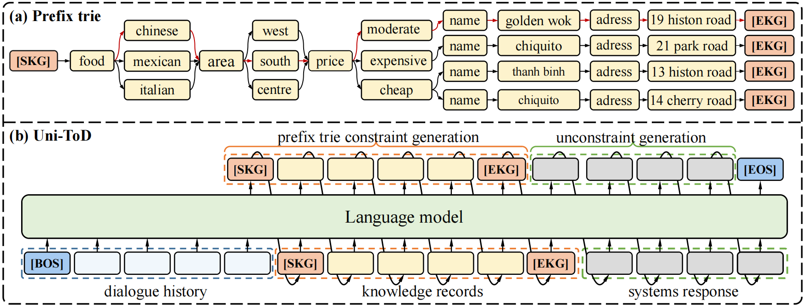

# From Retrieval to Generation: A Simple and Unified Generative Model for End-to-End Task-Oriented Dialogue

This repository contains the official `PyTorch` implementation of the paper:

**From Retrieval to Generation: A Simple and Unified Generative Model for End-to-End Task-Oriented Dialogue.** AAAI 2024. [[Paper]](https://ojs.aaai.org/index.php/AAAI/article/view/29745)

## We will update the code within two weeks

## Abstract

Retrieving appropriate records from the external knowledge base to generate informative responses is the core capability of end-to-end task-oriented dialogue systems (EToDs). Most of the existing methods additionally train the retrieval model or use the memory network to retrieve the knowledge base, which decouples the knowledge retrieval task from the response generation task, making it difficult to jointly optimize and failing to capture the internal relationship between the two tasks. In this paper, we propose a simple and unified generative model for task-oriented dialogue systems, which recasts the EToDs task as a single sequence generation task and uses maximum likelihood training to train the two tasks in a unified manner. To prevent the generation of non-existent records, we design the prefix trie to constrain the model generation, which ensures consistency between the generated records and the existing records in the knowledge base. Experimental results on three public benchmark datasets demonstrate that our method achieves robust performance on generating system responses and outperforms the baseline systems. 

## Architecture



The end-to-end model framework. Figure (a) is a part of the prefix trie, which is constructed from the knowledge base. Where ‘[SKG]’ represents the beginning of records in the knowledge base, and ‘[EKG]’ represents the end of records. Figure (b) is the overall flow of the model. When the language model generates the special token ‘[SKG]’, the language model generates related records under the constraints of the prefix trie. After the language model generates the special token ‘[EKG]’, the language model starts to generate the system response without constraint.

## How to Run it

### Environment
The environment configuration we used for training and testing is as follows:
```
transformers
tensorboard
nltk
sentencepiece
torch
```

### Training

The script train.py acts as a main function to the project, you can run the experiments by the following commands.

```bash
python train.py --dataset <dataset name>  --params_file config/gpt2/params.json --device cuda
```

### Evaluation
```bash
python eval.py --generate <path to the saved model> --dataset <dataset name>  --generation_params_file config/gpt2/generation_params.json --eval_dataset test  --output_file <the path to output file>
```

Due to some stochastic factors(e.g., GPU and environment), it maybe need to slightly tune the hyper-parameters using grid search to reproduce the results reported in our paper. 


## Citation

If you use any source codes or the datasets included in this toolkit in your work, please cite the following paper. The bibtex are listed below:

```
@article{Ding_Yang_Luo_Sun_Lin_2024,
title={From Retrieval to Generation: A Simple and Unified Generative Model for End-to-End Task-Oriented Dialogue},
volume={38},
url={https://ojs.aaai.org/index.php/AAAI/article/view/29745},
DOI={10.1609/aaai.v38i16.29745},
number={16},
journal={Proceedings of the AAAI Conference on Artificial Intelligence},
author={Ding, Zeyuan and Yang, Zhihao and Luo, Ling and Sun, Yuanyuan and Lin, Hongfei},
year={2024},
month={Mar.},
pages={17907-17914} }
```

## Acknowledgement

We are highly grateful for the public code of the following papers, our code is partly based on them:

- **DialoKG: Knowledge-Structure Aware Task-Oriented Dialogue Generation.**

   Md Rashad Al Hasan Rony, Ricardo Usbeck, Jens Lehmann

   NAACL 2022 paper. [[Paper]](https://aclanthology.org/2022.findings-naacl.195.pdf) [[Code]](https://github.com/rashad101/DialoKG)


- **Q-TOD: A Query-driven Task-oriented Dialogue System.**

    Xin Tian, Yingzhan Lin, Mengfei Song, Siqi Bao, Fan Wang, Huang He, Shuqi Sun, Hua Wu.

    EMNLP 2022. [[Paper]](https://aclanthology.org/2022.emnlp-main.489.pdf) [[Code]](https://github.com/PaddlePaddle/Knover/tree/develop/projects/Q-TOD)


